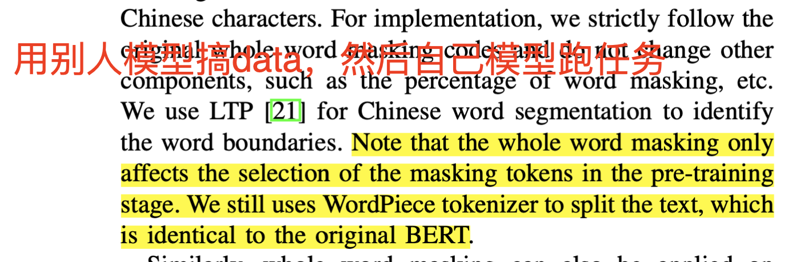
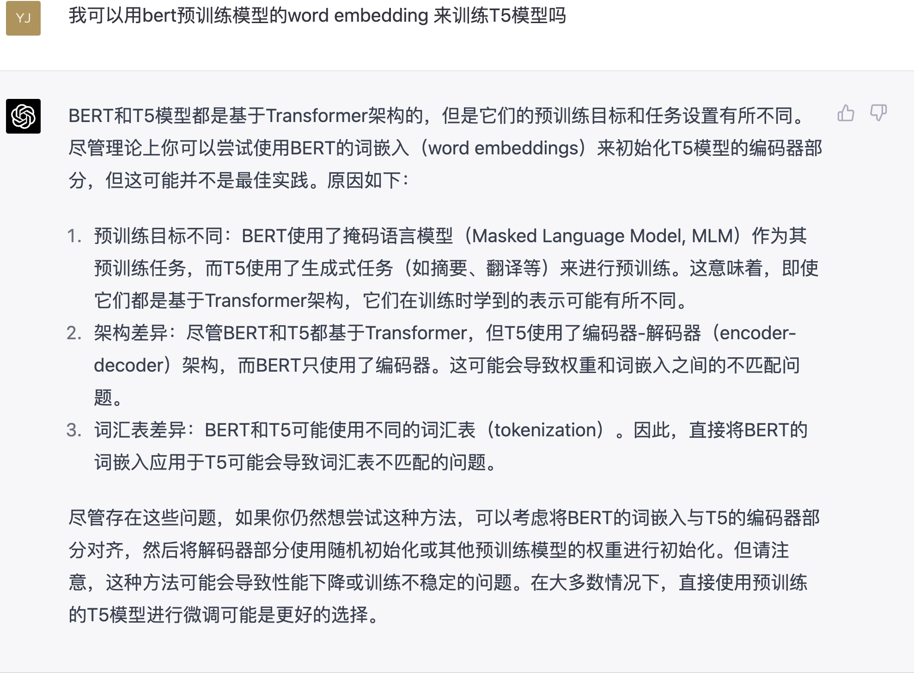

# Poem_Analyst
This is a course project from NUS-ISS about Practical Language Processing. We are dedicated to help 
poem(especially chinese poem) lovers to better understand the imagery, emotion, events mentioned in poems.

一些想法：

古诗词有比较特殊的文本结构，通常的word embedding不太能够正确表示，需要在bert-wwm上重新预训练

古诗词的tokenizer需要把特殊的意象，事件分词，避免切分意象

在这基础上，有两个分支，可以做知识图谱+图像生成，或者白话翻译+图像生成

update: 2023/3/24  
分支二改成 基于chinese-bert-wwm，在古诗词上做典故识别，模型需要做到从古诗词里识别
典故，然后将modified好的message传给chatgpt，让他解释典故  
如："庄生晓梦迷蝴蝶，望帝春心托杜鹃"-- 模型识别：梦蝶  
"梦蝶" --> chatgpt message-->"'梦蝶'是什么典故"  
response from chatgpt:   
"梦蝶"是一个源自中国哲学家庄子的典故，它是指庄子的一个著名哲学思想：庄周梦蝶。这个典故来自于庄子的《庄子·齐物论》一篇，描述了庄子的一个经典哲学观念。
这个典故的核心思想是关于现实与幻觉之间的边界，以及主体与客体之间的关系。故事讲述了庄子梦见自己变成了一只蝴蝶，飞舞自在，尽情地享受生活。当他醒来后，发现自己还是庄子。于是他开始思考：他究竟是庄子梦见了蝴蝶，还是蝴蝶在梦中变成了庄子？

## ==安装huggingface==
conda install -c huggingface transformers
这个得在pytorch或者tensorflow支持下运行
根据自己电脑去https://pytorch.org/get-started/locally/安装pytorch
conda install pytorch torchvision torchaudio -c pytorch

## ==mac 装torch with GPU==
link：https://www.youtube.com/watch?v=VEDy-c5Sk8Y

## == weights you might want to use==
https://drive.google.com/drive/folders/1D0K5npxx9PBsHhMe5y8fmXoAz7mOUXgx?usp=sharing

## ==LTP==
pip install ltp
link: https://ltp.ai/docs/quickstart.html#id6

## ==hint1==

ltp的模型是黑盒的，看起来像一个工具，用这个工具做分词，基于分词结果做masking，这样
就有可能有类似 床前[MASK][MASK]光 的训练数据，模型要学会预测 "明月"

假如不用ltp分词，直接全词掩码，出来的数据依然是 类似 床前[MASK]月光的数据

## ==hint2==

好像有点问题，bert只是个encoder，没有decoder的部分，所以用bert训练出来的词向量，
虽然是更好的，但在任务导向下，未必会在生成任务中，展现很好的效果