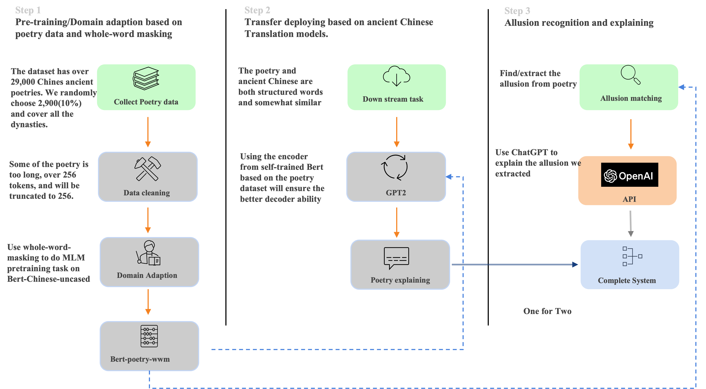
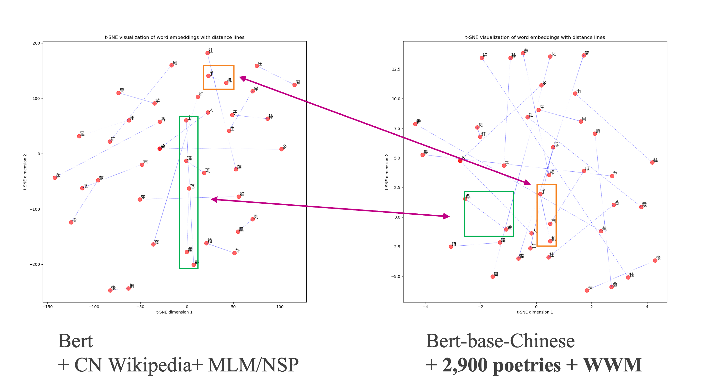
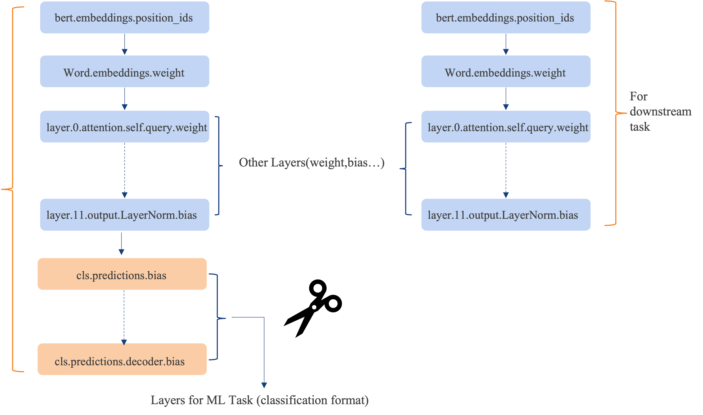
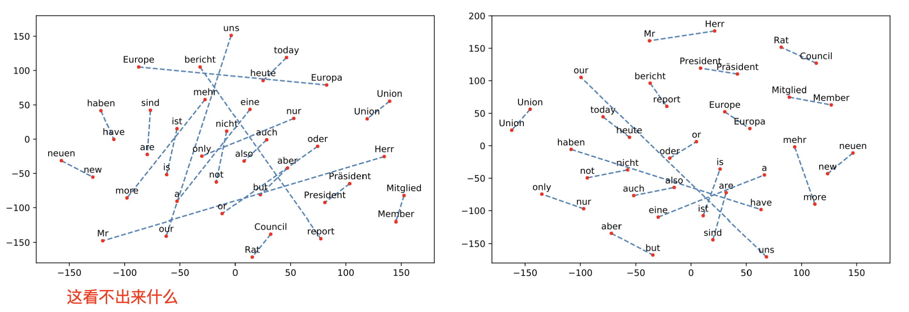

# Poem_Analyst
This is a course project from NUS-ISS about Practical Language Processing. We are dedicated to help 
poem(especially chinese poem) lovers to better understand the imagery, emotion, events mentioned in poems.

  
Date: 2023/5/20  
## Project Outline
The whole system has the following structure:  
  
**Step 1:** Domain adaptation: We begin with the Bert-base-Chinese pre-trained model, which has been trained on a large Chinese corpus, including content from Chinese Wikipedia. While this model may have some understanding of Chinese poetry, our goal is to create a language model with expertise in this domain. To achieve this, we use continuous training and apply a specific pre-training strategy called whole-word masking.

**Step 2:** Text translation, we use our self-trained Bert model as the encoder and a GPT-2 model as the decoder to perform a text-to-text task.

**Step 3:** Allusion recognition, we utilize the Bert-poetry model again for a downstream task focused on allusion recognition. Allusions are fascinating linguistic phenomena that resemble quotations or callbacks. We will also incorporate ChatGPT to help explain the allusions we identify.

## Visulaization in step 1
  
This is the demonstration of the T-SNE visualization of the embeddings of the words in the poem.  
Inside the green box are associated words often showcase in model Chinese corpus,
while the red box are the words that are more likely to appear in the poem. After domain adaption,
The distance of the words in the poem is much closer than the words in the model corpus.

## Transfer learning for step 2, step 3
  
Pop the cls layer.


---
[Link to checkpoints](https://drive.google.com/drive/folders/11CiEeivUyZEVpMbPuwu3Hj5cZGwgW_PR?usp=sharing)  
<font face="黑体" color=black size=6>一些想法：</font>

古诗词有比较特殊的文本结构，通常的word embedding不太能够正确表示，需要在bert-wwm上重新预训练  
[中文全词掩码paper_哈工大](https://ieeexplore.ieee.org/abstract/document/9599397)  
[huggingface关于wwm的解释](https://huggingface.co/course/zh-CN/chapter7/3?fw=pt)  
古诗词的tokenizer需要把特殊的意象，事件分词，避免切分意象

在这基础上，有两个分支，可以做知识图谱+图像生成，或者白话翻译+图像生成

update: 2023/3/24  
分支二改成 基于chinese-bert-wwm，在古诗词上做典故识别，模型需要做到从古诗词里识别
典故，然后将modified好的message传给chatgpt，让他解释典故  
[典故识别参考资料](https://colips.org/conferences/ialp2019/ialp2019.com/files/papers/IALP2019_064.pdf)  
如："庄生晓梦迷蝴蝶，望帝春心托杜鹃"-- 模型识别：梦蝶  
"梦蝶" --> chatgpt message-->"'梦蝶'是什么典故"  
response from chatgpt:   
"梦蝶"是一个源自中国哲学家庄子的典故，它是指庄子的一个著名哲学思想：庄周梦蝶。这个典故来自于庄子的《庄子·齐物论》一篇，描述了庄子的一个经典哲学观念。
这个典故的核心思想是关于现实与幻觉之间的边界，以及主体与客体之间的关系。故事讲述了庄子梦见自己变成了一只蝴蝶，飞舞自在，尽情地享受生活。当他醒来后，发现自己还是庄子。于是他开始思考：他究竟是庄子梦见了蝴蝶，还是蝴蝶在梦中变成了庄子？

## Environment setup
```commandline
pip install forgebox
pip install pytorch-lightning
pip install gcutils
pip install python-env-utils
pip install rglob
pip install tqdm
pip install transformers==4.11.0
```
## How to run the model
```commandline
python main.py 
```
Make sure you are in right path, and you can run all the models with same command in shell.

## Licence
This project is licensed under the terms of the MIT License.


## mac 装torch with GPU
link：https://www.youtube.com/watch?v=VEDy-c5Sk8Y

## weights you might want to use
https://drive.google.com/drive/folders/1D0K5npxx9PBsHhMe5y8fmXoAz7mOUXgx?usp=sharing

## LTP
pip install ltp
link: https://ltp.ai/docs/quickstart.html#id6

---

## hint1
ltp的模型是黑盒的，看起来像一个工具，用这个工具做分词，基于分词结果做masking，这样
就有可能有类似 床前[MASK][MASK]光 的训练数据，模型要学会预测 "明月"

假如不用ltp分词，直接全词掩码，出来的数据依然是 类似 床前[MASK]月光的数据

## hint2

<mark style="background: #FF5582A6;">Hint:</mark> 我也可以用这个t-SNE (Maaten and Hinton, 2008) 的方法去visulaize wwm之前和之后的区别，比如说之前 H("明月")=avg(H("明")+H("月"))
图像展示是三个点的连线
用了wwm甚至weam的方法后，也是三个点的连线，可能会导致更短的距离，但最明显的区别是，之前的第三点是数学表示出来的，实际不存在，而用了新的训练方法后，这是一个实际存在的点

## hint3
The learning rate we used in the paper was 1e-4. However, if you are doing additional steps of pre-training starting from an existing BERT checkpoint, you should use a smaller learning rate (e.g., 2e-5).
Link: [Google-research/bert](https://github.com/google-research/bert#:~:text=The%20learning%20rate%20we%20used%20in%20the%20paper%20was%201e%2D4.%20However%2C%20if%20you%20are%20doing%20additional%20steps%20of%20pre%2Dtraining%20starting%20from%20an%20existing%20BERT%20checkpoint%2C%20you%20should%20use%20a%20smaller%20learning%20rate%20(e.g.%2C%202e%2D5).)

